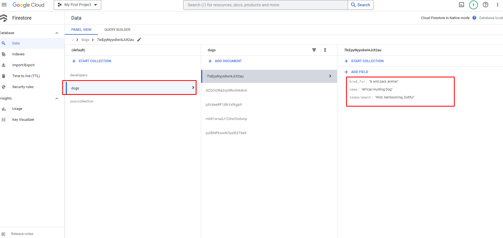

# Aview International Round2 Code Challenge

### Objective

It is a Python-based serverless application using AWS Lambda that fetches data from a public API, processes the data, and stores it in a NoSQL database hosted in the Google Cloud. The application is containerized using Docker.
* It is AWS Lambda Python application.
* It uses [Serverless Framework](https://www.serverless.com/framework/docs) 
* Fetch data from [DogAPI](https://api.thedogapi.com)
* Save data into **Firebase** on **Google Cloud**
* It uses **Docker** to containerize application.

### How to install

##### Installation steps
* Go to https://console.aws.amazon.com/iam/home?region=us-east-1#/security_credentials
* Create `New Access Key`
* Clone this repo.
* `cd PROJECT_FOLDER_NAME`
* `touch .env.docker`
* Update `aws_access_key_id` and `aws_secret_access_key`

##### Run and deploy
* Run `bash run.sh`
* Within docker shell `sls deploy -v`
* Visit the API URL once it's displayed.
* To destroy and remove lambda/api `sls remove`.

##### To Run Natively
* RUN `serverless config credentials --provider aws --key YOUR_KEY --secret YOUR_SECRET`
* RUN ` sls plugin install -n serverless-python-requirements` 
* `sls deploy -v` 

### Results
Stored data in Firebase

